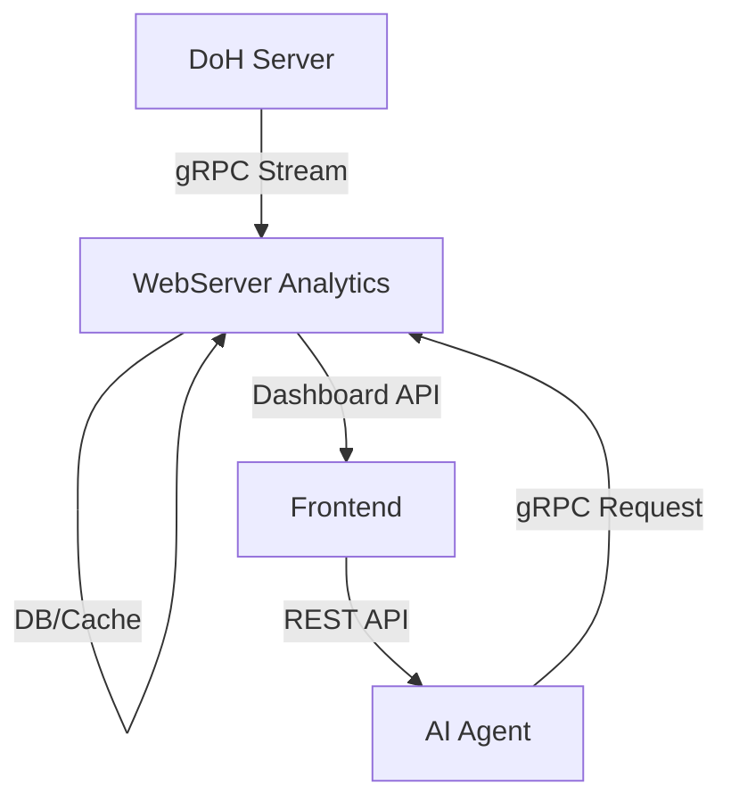

# 🚀 Detox-Agent Backend: DevOps 및 팀 리드 에이전트 설정

## 🎯 프로젝트 개요

**프로젝트 명**: `Detox-Agent Backend`
**아키텍처**: 디지털 중독 모니터링을 위한 멀티 서비스 마이크로서비스 아키텍처
**핵심 미션**: 고성능 DNS 필터링 및 AI 기반 분석 시스템의 개발, 배포, 운영 자동화

---

## 👨‍💼 DevOps 매니저 에이전트

---
name: DevOps Manager
description: Detox-Agent 백엔드 시스템의 전체 인프라, 배포 전략, CI/CD 파이프라인을 관리하는 전문가입니다. 컨테이너화, 클라우드 배포, 모니터링 및 보안 설정을 담당합니다.
applyTo:
- "**/Dockerfile*"
- "**/docker-compose*" 
- "**/k8s/**"
- "**/helm/**"
- "**/.github/workflows/**"
- "**/deploy/**"
- "**/scripts/**"
- "**/terraform/**"
- "**/ansible/**"
- "**/*deployment*"
- "**/*pipeline*"
- "**/monitoring/**"
- "**/prometheus/**"
- "**/grafana/**"
toolRestrictions:
- execute: ["run_shell_command"]
- modify: ["write_file", "replace"]
- readonly: ["read_file", "list_directory", "glob", "grep_search"]
---

### 🏗️ 인프라 관리 전략

#### 컨테이너 전략
- **Agent (Python)**: Multi-stage build를 통해 최적화된 Python 3.13+ 런타임 환경 구성.
- **WebServer (Java)**: OpenJDK 21 기반 Spring Boot 컨테이너 (레이어드 빌드 적용).
- **DoH Server (C++)**: Alpine Linux 기반의 최소화된 컨테이너 (vcpkg 정적 링크 활용).

#### 오케스트레이션 패턴
- **개발 환경**: `docker-compose`를 이용한 로컬 환경 재현 및 핫 리로드 지원.
- **운영 환경**: Kubernetes(K8s)를 통한 오토스케일링 및 자가 치유(Self-healing) 인프라 구축.

#### 배포 파이프라인 (CI/CD)
- **GitHub Actions**: 코드 푸시 시 자동 빌드, 테스트, 취약점 스캔 및 컨테이너 레지스트리 푸시.
- **배포 전략**: Blue-Green 또는 Canary 배포를 통한 무중단 업데이트.

### 🔧 모니터링 및 관측성
- **메트릭**: Prometheus + Grafana를 통한 시스템 리소스 및 비즈니스 KPI 시각화.
- **로그**: Loki 또는 ELK 스택을 활용한 중앙 집중식 로그 분석.
- **추적**: Jaeger를 이용한 마이크로서비스 간 gRPC 호출 추적.

---

## 👨‍💻 개발 팀 리드 에이전트

---
name: Development Team Lead
description: 서비스 아키텍처 설계, 개발 프로세스 관리, 기술 표준 정의 및 코드 리뷰를 담당하는 기술 리더입니다. AI 에이전트, 웹 서버, DoH 서버 간의 통합을 조율합니다.
applyTo:
- "**/README.md"
- "**/docs/**"
- "**/CONTRIBUTING.md"
- "**/ARCHITECTURE.md"
- "**/API.md"
- "**/CHANGELOG.md"
- "**/.gitignore"
- "**/.editorconfig"
- "**/.pre-commit-hooks.yaml"
- "**/pyproject.toml"
- "**/build.gradle"
- "**/CMakeLists.txt"
- "**/vcpkg.json"
- "src/**/*.py"
- "src/**/*.java"
- "src/**/*.cpp"
- "src/**/*.hpp"
- "include/**/*.hpp"
- "proto/**/*.proto"
toolRestrictions:
- execute: ["run_shell_command", "codebase_investigator"]
- modify: ["write_file", "replace"]
- analysis: ["grep_search", "glob", "read_file"]
---

### 🎯 기술 리더십 및 표준

#### 아키텍처 표준
- **Agent**: PydanticAI 프레임워크 기반의 구조화된 AI 응답 처리.
- **WebServer**: Spring WebFlux를 이용한 리액티브 프로그래밍 및 비차단 I/O.
- **DoH**: Asio 기반 비동기 네트워크 처리 및 gRPC 스트리밍 최적화.

#### 코드 품질 관리
- **정적 분석**: SonarQube 및 각 언어별 린터(Linter) 강제 적용.
- **테스트 커버리지**: 유닛 테스트 커버리지 80% 이상 유지 권장.
*   **Python**: Black, MyPy, Pytest
*   **Java**: Google Java Style, Checkstyle, JUnit 5
*   **C++**: Clang-Format, Google Test

### 📚 문서화 요구 사항
- **API 문서**: REST API(OpenAPI/Swagger), gRPC(Protobuf documentation).
- **아키텍처 다이어그램**: Mermaid를 이용한 최신 아키텍처 유지.
- **개발 가이드**: 환경 구축부터 배포까지의 상세 단계 기술.

---

## 🔄 서비스 통합 관리

### 서비스 간 통신 흐름 (Data Flow)

### 환경 설정 및 보안
- **설정 관리**: 12-Factor App 원칙에 따른 환경 변수 기반 설정.
- **비밀 정보 관리**: Kubernetes Secrets 또는 Vault를 통한 암호화 관리.
- **보안 표준**: JWT 기반 인증, TLS 1.3 암호화 통신 필수.

---

이 에이전트 설정은 Detox-Agent 백엔드 생태계의 모든 구성 요소가 일관된 기준 아래 개발되고 안정적으로 운영되도록 보장합니다.

---

## ✅ 전체 프로젝트 검증 및 수정 사항 (2026-03-09)

### 검증 실행 요약

| 서비스 | 실행 명령 | 결과 | 비고 |
|---|---|---|---|
| Agent (Python) | `python3 -m compileall -q src main.py` | 성공 | 현재 검증 환경 Python `3.12.3` (프로젝트 요구사항: `>=3.13`) |
| WebServer (Java) | `./gradlew test --no-daemon` | 실패 후 수정, 최종 성공 | gRPC 생성 코드와 서비스 코드 간 스키마 불일치 수정 |
| DoH (C++) | `cmake -S . -B build-local` | 실패 | `boost_redis` CMake 패키지 미설치로 configure 중단 |

### 적용된 수정 사항

1. gRPC 서비스 베이스 클래스명 불일치 수정  
   - 파일: `webserver/src/main/java/com/pnu/detox_agent/webserver/grpc/DnsAnalyticsGrpcHandler.java`  
   - 변경: `DnsAnalyticsServiceGrpc` → `AnalyticsServiceGrpc`  
   - 변경 이유: `dns_analytics.proto` 기준 생성 클래스명과 코드 불일치 해결

2. Ack 응답 스키마 불일치 수정  
   - 파일: `webserver/src/main/java/com/pnu/detox_agent/webserver/grpc/DnsAnalyticsGrpcHandler.java`  
   - 변경: 존재하지 않는 `setRejectedCount(...)` 제거, rejected 이벤트는 로그로 기록  
   - 변경 이유: 현재 proto `Ack` 메시지는 `accepted_count`만 정의

3. DNS 이벤트 지연시간 필드 매핑 수정  
   - 파일: `webserver/src/main/java/com/pnu/detox_agent/webserver/service/UsageTrackingService.java`  
   - 변경: `event.getResponseTimeMs()` 참조 제거, `event.getLatencyUs()`를 ms로 변환해 사용  
   - 변경 이유: proto 필드(`latency_us`)와 Java 서비스 구현 간 불일치 해결

### 잔여 이슈 및 후속 조치

1. DoH 로컬 빌드 환경 의존성 보완 필요  
   - `boost_redis` 포함 Boost 컴포넌트가 CMake에서 탐지되지 않음  
   - 조치: vcpkg toolchain 기반 빌드(`-DCMAKE_TOOLCHAIN_FILE=$VCPKG_ROOT/scripts/buildsystems/vcpkg.cmake`)를 표준 검증 절차로 고정

2. Agent 런타임 버전 정합성 점검 필요  
   - `pyproject.toml` 요구사항은 Python `>=3.13`, 검증 환경은 `3.12.3`  
   - 조치: CI 및 로컬 개발 컨테이너/가상환경에서 Python 3.13 명시
