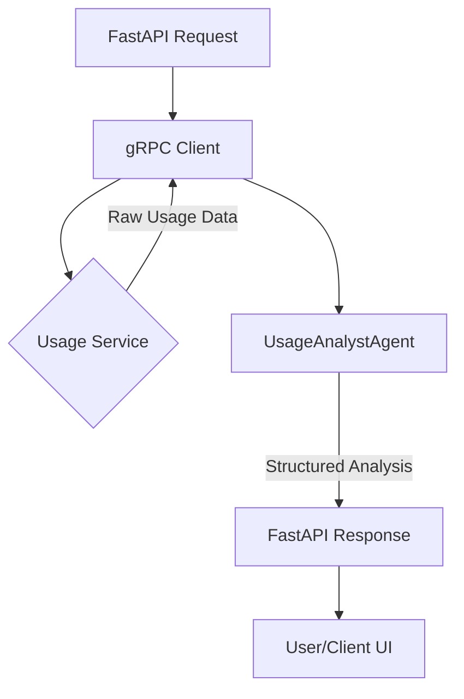

# Detox AI Monitoring Agent (AGENTS.md)

This document defines the architecture, behavior, and design principles of the AI Agents used in the Detox-Agent backend. We leverage **PydanticAI** to build structured, type-safe, and highly specialized agents.

## 🤖 Agent: `UsageAnalystAgent`

The `UsageAnalystAgent` is responsible for analyzing raw domain usage data fetched via gRPC and providing actionable, human-centric feedback to help users manage digital addiction.

### 🎯 Core Mission
Analyze daily, weekly, and monthly domain usage patterns. Identify "addictive" behaviors (e.g., excessive YouTube, SNS, or gaming) and provide "nudges" or monitoring responses that encourage a healthier digital lifestyle.

### 🛠 Technology Stack
- **Framework**: [PydanticAI](https://pydantic-ai.pydantic.dev/)
- **Data Model**: Pydantic v2 (Strict validation of LLM outputs)
- **Logic**: Python 3.13+
- **Inference**: OpenAI (GPT-4o) or Google Gemini (Pro 1.5)

---

### 🧠 Agent Persona & System Prompt
The agent acts as a **"Compassionate Digital Health Coach"**. It is not robotic but firm and grounded in data.

**System Prompt Overview:**
> You are an expert Digital Health & Productivity coach. Your task is to analyze a user's domain usage data (domain name, duration in seconds, frequency). 
> 1. **Identify Red Flags**: Look for domains like `youtube.com`, `tiktok.com`, `instagram.com` or gaming sites with duration exceeding 2 hours/day.
> 2. **Analyze Trends**: Compare daily vs. weekly data to see if addiction is scaling.
> 3. **The Response**: 
>    - If usage is healthy: Provide a brief, encouraging validation.
>    - If usage is borderline: Give a subtle "nudge" about time management.
>    - If usage is excessive (Addiction State): Provide a firm, slightly discouraging (yet helpful) response. Suggest specific alternatives (e.g., "instead of 4 hours on YouTube, you could have read 50 pages of a book").

---

### 📊 Structured Output (Pydantic Models)

We ensure the AI always returns a valid schema to the FastAPI layer.

```python
class UsageAnalysis(BaseModel):
    is_addicted: bool = Field(description="True if the usage pattern indicates potential digital addiction.")
    risk_level: Literal["Low", "Medium", "High", "Critical"]
    addictive_domains: List[str] = Field(description="List of domains causing the most concern.")
    summary: str = Field(description="A concise summary of the usage analysis.")
    recommendation: str = Field(description="A personalized 'detox' recommendation or nudge.")
    suggested_limit_seconds: Optional[int] = Field(description="Optional suggested daily limit for the top offending domain.")
```

---

### 🔄 Data Flow (Component Integration)



1. **Extraction**: `UsageService` (gRPC) provides `repeated DomainUsage`.
2. **Contextualization**: Raw data is formatted into a readable context for the LLM.
3. **Reasoning**: The PydanticAI agent runs internal logic based on the system prompt.
4. **Validation**: PydanticAI validates the LLM output against the `UsageAnalysis` model.
5. **Action**: FastAPI returns the structured monitoring response.

---

### 📈 Future Roadmap
- **Multi-Agent Collaboration**: A secondary agent to generate "Detox Challenges" based on the patterns identified by the `UsageAnalystAgent`.
- **Memory Integration**: Using a vector database or SQL to track long-term behavioral changes across months.
- **Dynamic Tooling**: Allowing the agent to "query" external productivity resources or block lists based on the analysis.
