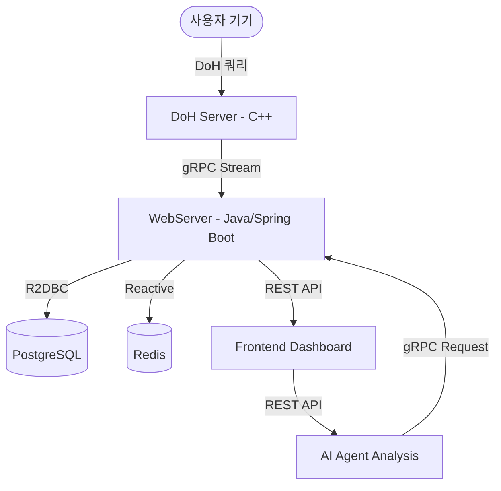

# 🚀 Detox-Agent Backend: 디지털 중독 방지 시스템

디지털 중독 문제를 해결하기 위해 네트워크 수준의 DNS 필터링과 AI 기반의 사용 패턴 분석을 결합한 고성능 백엔드 생태계입니다.

## 🎯 프로젝트 개요

Detox-Agent는 사용자가 자신의 디지털 습관을 인지하고 제어할 수 있도록 돕습니다. 네트워크 레벨에서 DNS 쿼리를 가로채어 유해/중독성 사이트 접속을 제어하고, 수집된 데이터를 AI가 분석하여 개인 맞춤형 리포트와 가이드를 제공합니다.

## 🏗️ 전체 시스템 아키텍처

본 시스템은 마이크로서비스 아키텍처(MSA)를 따르며, 성능 최적화를 위해 gRPC를 주요 통신 프로토콜로 사용합니다.



### 서비스 간 통신 매커니즘
1.  **DoH Server → WebServer**: DNS 쿼리 발생 시 실시간으로 gRPC 클라이언트 스트리밍을 통해 분석 데이터를 전송합니다.
2.  **AI Agent → WebServer**: 분석 리포트 생성 시, WebServer의 gRPC 서버에 접속하여 해당 사용자의 도메인 방문 기록과 통계 데이터를 가져옵니다.
3.  **Frontend → WebServer/Agent**: 사용자는 대시보드를 통해 실시간 통계를 확인하거나(REST), AI 분석을 직접 요청(REST)할 수 있습니다.

## 🛠️ 주요 구성 요소

### 1. [DoH Server (C++)](./DoH/)
**Boost.Beast**와 **Asio**를 기반으로 구현된 고성능 DNS-over-HTTPS 포워더입니다.
- **역할**: DNS 쿼리 암호화 및 필터링, 실시간 쿼리 분석 데이터 스트리밍.
- **기술 스택**: C++20, OpenSSL, gRPC, vcpkg.
- **성능 목표**: 10ms 이내의 DNS 응답 지연 시간 및 10,000개 이상의 동시 연결 처리.

### 2. [WebServer (Java/Spring Boot)](./webserver/)
시스템의 비즈니스 로직과 데이터 관리를 담당하는 중앙 허브입니다.
- **역할**: DNS 분석 데이터 집계, 사용자 관리, 대시보드 API 제공, AI 에이전트를 위한 데이터 서빙.
- **기술 스택**: Spring Boot 3.4+, WebFlux (Reactive), Spring gRPC, PostgreSQL (R2DBC), Redis.
- **특징**: 완전 비차단(Non-blocking) 아키텍처를 통한 높은 확장성 확보.

### 3. [AI Agent (Python)](./Agent/)
LLM(대형 언어 모델)을 활용하여 지능적인 분석과 제안을 수행하는 엔진입니다.
- **역할**: 도메인 사용 패턴 분석(생산성 vs 중독성 분류), 맞춤형 디지털 해독 리포트 생성.
- **기술 스택**: Python 3.13, FastAPI, PydanticAI, gRPC.
- **AI 모델**: PydanticAI 프레임워크를 통해 타입 안전한 LLM 인터랙션을 보장합니다.

### 4. [Frontend (React/Vite)](./frontend/)
웹 대시보드 및 API 연동 확인을 위한 프론트엔드 개발 서버입니다.
- **역할**: 사용자 통계 조회 UI, 백엔드 REST API 연동, 개발용 대시보드.
- **기술 스택**: React 19, Vite 7.
- **연동 방식**: `/api` 경로를 `WebServer(8080)`로 프록시.

## 🚀 빠른 시작 가이드

### 필수 요구 사항
- Docker 및 Docker Compose
- Java 21 / Python 3.13 / C++ 컴파일러 (로컬 빌드 시)

### Docker Compose를 이용한 일괄 실행
```bash
# 저장소 클론
git clone https://github.com/org/detox-agent-backend.git
cd detox-agent-backend

# 환경 변수 파일 준비
cp .env.example .env
# 필요 시 .env 값 수정 (예: OPENAI_API_KEY)

# 전체 서비스 빌드 + 실행
docker compose up -d --build
```

- Frontend: `http://localhost:3000`
- WebServer API: `http://localhost:8080`
- Agent API: `http://localhost:8000`

중지:

```bash
docker compose down
```

### Kubernetes 실행

```bash
# 이미지 빌드
docker build -t detox/webserver:latest ./webserver
docker build -t detox/agent:latest ./Agent
docker build -t detox/frontend:latest ./frontend

# 매니페스트 적용
kubectl apply -k deploy/k8s
```

- Frontend(NodePort): `http://<NODE_IP>:30080`
- 상세 가이드: `deploy/README.md`

### 서비스별 개별 실행 (개발용)
- **AI 에이전트**: `cd Agent && uv run src/api/main_api.py`
- **웹 서버**: `cd webserver && ./gradlew bootRun`
- **DoH 서버**: `cd DoH && cmake --build build && ./build/doh_server`
- **프론트엔드**: `cd frontend && npm install && npm run dev`

## 📊 모니터링 및 운영
- **메트릭**: Prometheus를 통해 각 서비스의 상태를 수집합니다.
- **시각화**: Grafana 대시보드에서 DNS 지연 시간, 시스템 리소스, 사용자 활동량을 모니터링합니다.
- **로그**: ELK 또는 Loki를 통해 로그를 중앙 집중화하여 관리합니다.

## 🤝 기여 방법
이 프로젝트에 기여하고 싶으시다면 [CONTRIBUTING.md](CONTRIBUTING.md)를 확인해 주세요. 모든 풀 리퀘스트를 환영합니다!

## 📜 라이선스
이 프로젝트는 MIT 라이선스를 따릅니다. 자세한 내용은 [LICENSE](LICENSE) 파일을 참조하세요.
