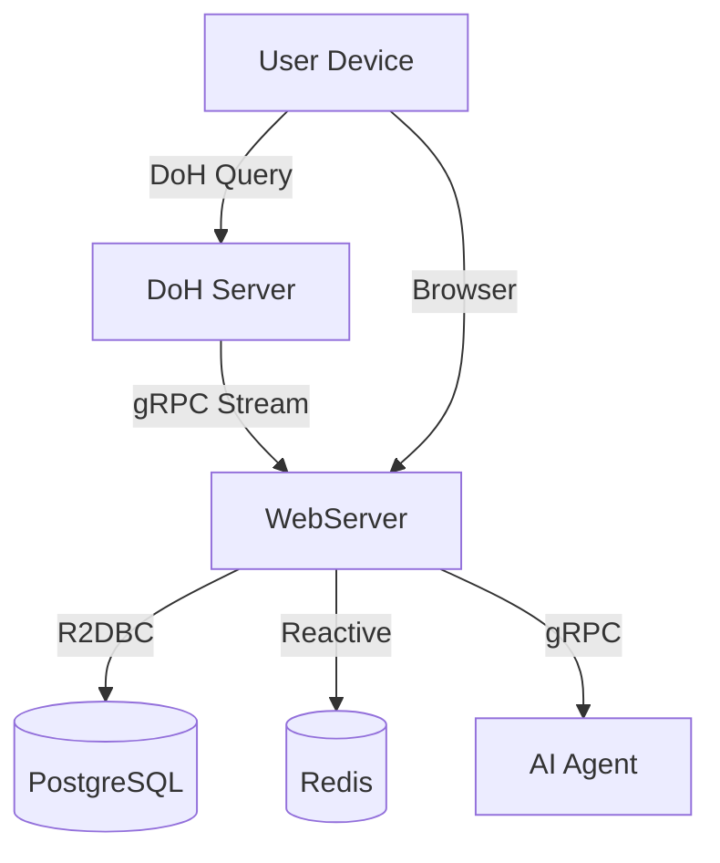

# DetoxAgent 🛡️📊

> DNS filtering, usage analytics, and AI-assisted digital habit review


DetoxAgent는 개인 전용 DoH(DNS-over-HTTPS) 엔드포인트를 통해 DNS 요청을 수집하고, 사용자별 사용 패턴을 집계한 뒤 대시보드와 AI 리뷰로 보여주는 프로젝트입니다.

현재 저장소에는 다음 구성이 포함되어 있습니다.
- `DoH`: C++ 기반 DoH forwarder
- `webserver`: Spring WebFlux + Thymeleaf 기반 인증, 집계, 웹 UI
- `Agent`: Python 기반 AI 리뷰 서비스

## 프로젝트 목표

- 사용자별 DoH 엔드포인트 발급
- DNS 이벤트 실시간 수집 및 저장
- 기간별 사용량 집계와 도메인 분석
- 차단 목록 관리
- AI 기반 사용 패턴 리뷰 스트리밍

## 현재 구현 범위

### 구현됨
- 회원가입 / 로그인 / JWT 인증
- 사용자별 DoH URL 발급
- DoH 요청 수신 및 upstream DNS forwarding
- WebServer gRPC 수집기로 DNS 이벤트 적재
- Redis + PostgreSQL 기반 사용량 집계
- 일/주/월 사용량 조회 API
- 차단 도메인 CRUD 및 Redis 동기화
- Thymeleaf 기반 대시보드 / 리뷰 / 차단 목록 UI
- Docker Compose 기반 로컬 통합 실행

### 미구현 또는 후속 작업
- Prometheus / Grafana 등 모니터링 스택
- 운영용 배포 자동화 완성
- Nudge landing page 전체 흐름
- 실서비스 수준의 보안/운영 하드닝

## 아키텍처



## 서비스 구성

### DoH
- 경로 기반 사용자 식별: `/{dohToken}/dns-query`
- UDP 우선 조회 후 truncation 또는 timeout 시 TCP fallback
- 허용된 DNS 이벤트를 WebServer로 gRPC 스트리밍
- Redis 차단 목록 기반 필터링

상세 문서: [DoH/README.md](/home/min/Workspace/Portfolio/Detox-Agent/DoH/README.md)

### WebServer
- Spring WebFlux 기반 REST/gRPC 서버
- Thymeleaf 템플릿 기반 로그인, 대시보드, 리뷰, 차단 목록 화면 제공
- 인증, 대시보드 API, 집계, 차단 목록 관리 담당
- Redis 실시간 상태와 PostgreSQL 영속 데이터를 함께 사용
- AI 리뷰 요청을 Agent와 연결

관련 문서: [docs/OVERVIEW.md](/home/min/Workspace/Portfolio/Detox-Agent/docs/OVERVIEW.md)

### Agent
- FastAPI + gRPC 기반 AI 리뷰 서비스
- 사용량 데이터를 바탕으로 요약, 위험 신호, 실행 조언 생성
- OpenAI 키가 없을 때는 mock 응답으로 fallback

상세 문서: [Agent/README.md](/home/min/Workspace/Portfolio/Detox-Agent/Agent/README.md)

## 저장소 구조

```text
.
├─ Agent/
├─ DoH/
├─ deploy/
├─ docs/
├─ scripts/
├─ webserver/
├─ docker-compose.yml
└─ README.md
```

## 빠른 시작

### 요구 사항
- Docker / Docker Compose
- 또는 Java 21, Python 3.13+, C++20 빌드 환경

### Docker Compose 실행

```bash
docker compose up -d --build
```

기본 포트:
- WebServer: `http://localhost:8080`
- Agent: `http://localhost:8000`

종료:

```bash
docker compose down
```

## 로컬 개발 실행

### WebServer

```bash
cd webserver
./gradlew bootRun
```

### Agent

```bash
cd Agent
uv sync
uv run main.py
```

### DoH

환경에 따라 vcpkg / Boost 설정이 필요합니다.

```bash
cd DoH
cmake -B build -DCMAKE_TOOLCHAIN_FILE=$VCPKG_ROOT/scripts/buildsystems/vcpkg.cmake
cmake --build build
```

### 셸 스크립트로 3개 서비스 동시 실행

`webserver`, `Agent`, `DoH`를 한 번에 띄우려면:

```sh
sh scripts/local-up.sh
sh scripts/local-status.sh
```

종료:

```sh
sh scripts/local-down.sh
```

`local-down.sh`는 `.run/*.pid`가 없어도 기본 포트를 기준으로 프로세스를 찾아 종료를 시도합니다. 다만 `sudo`로 띄운 프로세스는 일반 권한으로는 종료되지 않을 수 있으므로, 그 경우 `sudo kill ...` 또는 `sudo fuser -k ...`로 정리해야 합니다.

실행 전 권장 순서:

```sh
sudo fuser -k 8080/tcp 8000/tcp 50052/tcp 8443/tcp
```

DoH는 기본적으로 인증서 파일이 필요합니다. 로컬 테스트용 self-signed 인증서는 다음처럼 만들 수 있습니다.

```sh
cd DoH
mkdir -p certs
openssl req -x509 -nodes -days 365 -newkey rsa:2048 \
  -keyout certs/privkey.pem \
  -out certs/fullchain.pem \
  -subj "/CN=localhost"
cd ..
```

주의 사항:
- `scripts/local-up.sh`는 가능하면 `sudo` 없이 실행하는 편이 안전합니다.
- `sudo`는 포트 점유 프로세스 정리할 때만 사용하는 것을 권장합니다.
- `sudo`로 실행한 서비스는 `scripts/local-down.sh`에서 일반 권한으로 종료되지 않을 수 있습니다.
- 로그는 `logs/` 디렉터리에 저장됩니다.
- 셸 환경에 따라 `uv`가 PATH에 없을 수 있으므로 필요하면 `UV_BIN=/home/<user>/.local/bin/uv` 를 명시해 실행하세요.
- `scripts/local-up.sh`는 DoH 필터를 기본 활성화로 실행합니다. 끄려면 `DOH_FILTER_ENABLED=false`를 명시하세요.

## 주요 엔드포인트

### Auth
- `POST /api/auth/register`
- `POST /api/auth/login`

### Dashboard
- `GET /api/dashboard/users/{userId}/usage`
- `GET /api/dashboard/users/{userId}/domains`
- `GET /api/dashboard/users/{userId}/timeline`

### Blocklist
- `GET /api/blocklist`
- `POST /api/blocklist`
- `DELETE /api/blocklist/{domain}`

### AI Review
- `POST /api/ai/review/stream`

## 검증 상태

최근 로컬 기준 확인된 항목:
- `python3 -m compileall -q Agent/src Agent/main.py`
- `./gradlew test --no-daemon`

주의 사항:
- DoH 로컬 빌드는 환경 의존성이 큽니다.
- Python 3.13 요구사항과 로컬 인터프리터 버전은 별도 확인이 필요합니다.

## 주간 진행 상황

### Week 7
- 전체 DetoxAgent 흐름을 기준으로 서비스 역할과 데이터 흐름을 정리했습니다.
- WebServer, Agent, DoH 저장소 구조를 확정하고 초기 연동 방향을 맞췄습니다.
- 인증, DNS 수집, 대시보드, AI 리뷰를 하나의 사용자 흐름으로 묶는 기준을 세웠습니다.

### Week 8
- 사용자 인증과 DoH 엔드포인트 발급 흐름을 구체화했습니다.
- WebServer 중심의 REST / gRPC 인터페이스를 정리하고 기본 API 구성을 확장했습니다.
- 웹 대시보드에서 사용할 응답 구조를 맞추기 시작했습니다.

### Week 9
- DNS 이벤트 수집 이후 Redis / PostgreSQL에 적재하는 집계 흐름을 보강했습니다.
- 사용자별 사용량 조회, 기간별 통계, 도메인 목록 처리 로직을 다듬었습니다.
- 차단 목록 관리와 연동될 수 있도록 데이터 구조를 정리했습니다.

### Week 10
- WebServer 내 템플릿 기반 대시보드 UI와 인증 화면을 실제 API 흐름 기준으로 연결했습니다.
- AI 리뷰 요청을 SSE와 gRPC 기반 흐름으로 연결해 실시간 출력 구조를 만들었습니다.
- Docker Compose 기준으로 로컬 통합 실행이 가능하도록 서비스 포트와 연결을 정리했습니다.

### Week 11
- WebServer에 blocklist 관리, 템플릿 페이지, 도메인 집계 정책을 추가했습니다.
- Agent 쪽 AI 리뷰 서비스와 proto/generated client 구성을 정리했습니다.
- DoH는 UDP timeout / truncation 시 TCP fallback 되도록 보완했습니다.

### Week 12
- 루트 README와 각 서비스 문서를 현재 구현 상태 기준으로 다시 정리했습니다.
- PR 템플릿과 리뷰 메모를 추가해 변경 단위를 설명하기 쉽게 맞췄습니다.
- 미구현 영역과 후속 과제를 분리해 문서상 과장된 표현을 제거했습니다.

## 활동 추적


## 문서

- [docs/OVERVIEW.md](/home/min/Workspace/Portfolio/Detox-Agent/docs/OVERVIEW.md)
- [docs/backend-integration.md](/home/min/Workspace/Portfolio/Detox-Agent/docs/backend-integration.md)
- [DoH/README.md](/home/min/Workspace/Portfolio/Detox-Agent/DoH/README.md)
- [Agent/README.md](/home/min/Workspace/Portfolio/Detox-Agent/Agent/README.md)
- [scripts/README.md](/home/min/Workspace/Portfolio/Detox-Agent/scripts/README.md)
- [deploy/README.md](/home/min/Workspace/Portfolio/Detox-Agent/deploy/README.md)
