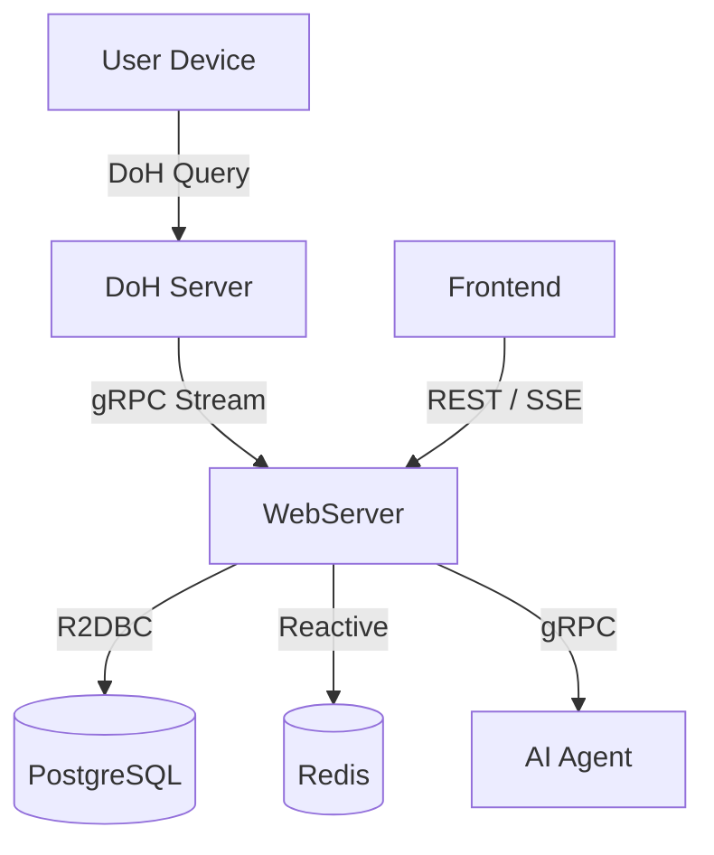

# DetoxAgent

> DNS filtering, usage analytics, and AI-assisted digital habit review

DetoxAgent는 개인 전용 DoH(DNS-over-HTTPS) 엔드포인트를 통해 DNS 요청을 수집하고, 사용자별 사용 패턴을 집계한 뒤 대시보드와 AI 리뷰로 보여주는 프로젝트입니다.

현재 저장소에는 다음 구성이 포함되어 있습니다.
- `DoH`: C++ 기반 DoH forwarder
- `webserver`: Spring WebFlux 기반 인증, 집계, 대시보드 API
- `Agent`: Python 기반 AI 리뷰 서비스
- `frontend`: React/Vite 기반 대시보드 UI

## 프로젝트 목표

- 사용자별 DoH 엔드포인트 발급
- DNS 이벤트 실시간 수집 및 저장
- 기간별 사용량 집계와 도메인 분석
- 차단 목록 관리
- AI 기반 사용 패턴 리뷰 스트리밍

## 현재 구현 범위

### 구현됨
- 회원가입 / 로그인 / JWT 인증
- 사용자별 DoH URL 발급
- DoH 요청 수신 및 upstream DNS forwarding
- WebServer gRPC 수집기로 DNS 이벤트 적재
- Redis + PostgreSQL 기반 사용량 집계
- 일/주/월 사용량 조회 API
- 차단 도메인 CRUD 및 Redis 동기화
- React 대시보드와 AI 리뷰 스트리밍 UI
- Docker Compose 기반 로컬 통합 실행

### 미구현 또는 후속 작업
- Prometheus / Grafana 등 모니터링 스택
- 운영용 배포 자동화 완성
- Nudge landing page 전체 흐름
- 실서비스 수준의 보안/운영 하드닝

## 아키텍처



## 서비스 구성

### DoH
- 경로 기반 사용자 식별: `/{dohToken}/dns-query`
- UDP 우선 조회 후 truncation 또는 timeout 시 TCP fallback
- 허용된 DNS 이벤트를 WebServer로 gRPC 스트리밍
- Redis 차단 목록 기반 필터링

상세 문서: [DoH/README.md](/home/min/Workspace/Portfolio/Detox-Agent/DoH/README.md)

### WebServer
- Spring WebFlux 기반 REST/gRPC 서버
- 인증, 대시보드 API, 집계, 차단 목록 관리 담당
- Redis 실시간 상태와 PostgreSQL 영속 데이터를 함께 사용
- AI 리뷰 요청을 Agent와 연결

관련 문서: [docs/OVERVIEW.md](/home/min/Workspace/Portfolio/Detox-Agent/docs/OVERVIEW.md)

### Agent
- FastAPI + gRPC 기반 AI 리뷰 서비스
- 사용량 데이터를 바탕으로 요약, 위험 신호, 실행 조언 생성
- OpenAI 키가 없을 때는 mock 응답으로 fallback

상세 문서: [Agent/README.md](/home/min/Workspace/Portfolio/Detox-Agent/Agent/README.md)

### Frontend
- React/Vite 기반 로그인, 회원가입, 대시보드 UI
- 사용량 요약, 도메인 랭킹, 타임라인 조회
- SSE 기반 AI 리뷰 스트리밍 표시

## 저장소 구조

```text
.
├─ Agent/
├─ DoH/
├─ deploy/
├─ docs/
├─ frontend/
├─ webserver/
├─ docker-compose.yml
└─ README.md
```

## 빠른 시작

### 요구 사항
- Docker / Docker Compose
- 또는 Java 21, Python 3.13+, Node.js 20+, C++20 빌드 환경

### Docker Compose 실행

```bash
docker compose up -d --build
```

기본 포트:
- Frontend: `http://localhost:3000`
- WebServer: `http://localhost:8080`
- Agent: `http://localhost:8000`

종료:

```bash
docker compose down
```

## 로컬 개발 실행

### WebServer

```bash
cd webserver
./gradlew bootRun
```

### Agent

```bash
cd Agent
uv sync
uv run main.py
```

### Frontend

```bash
cd frontend
npm install
npm run dev
```

### DoH

환경에 따라 vcpkg / Boost 설정이 필요합니다.

```bash
cd DoH
cmake -B build -DCMAKE_TOOLCHAIN_FILE=$VCPKG_ROOT/scripts/buildsystems/vcpkg.cmake
cmake --build build
```

## 주요 엔드포인트

### Auth
- `POST /api/auth/register`
- `POST /api/auth/login`

### Dashboard
- `GET /api/dashboard/users/{userId}/usage`
- `GET /api/dashboard/users/{userId}/domains`
- `GET /api/dashboard/users/{userId}/timeline`

### Blocklist
- `GET /api/blocklist`
- `POST /api/blocklist`
- `DELETE /api/blocklist/{domain}`

### AI Review
- `POST /api/ai/review/stream`

## 검증 상태

최근 로컬 기준 확인된 항목:
- `python3 -m compileall -q Agent/src Agent/main.py`
- `./gradlew test --no-daemon`
- `npm run build`

주의 사항:
- Frontend production bundle 크기 경고가 남아 있습니다.
- DoH 로컬 빌드는 환경 의존성이 큽니다.
- Python 3.13 요구사항과 로컬 인터프리터 버전은 별도 확인이 필요합니다.

## 문서

- [docs/OVERVIEW.md](/home/min/Workspace/Portfolio/Detox-Agent/docs/OVERVIEW.md)
- [docs/backend-integration.md](/home/min/Workspace/Portfolio/Detox-Agent/docs/backend-integration.md)
- [DoH/README.md](/home/min/Workspace/Portfolio/Detox-Agent/DoH/README.md)
- [Agent/README.md](/home/min/Workspace/Portfolio/Detox-Agent/Agent/README.md)
- [deploy/README.md](/home/min/Workspace/Portfolio/Detox-Agent/deploy/README.md)
