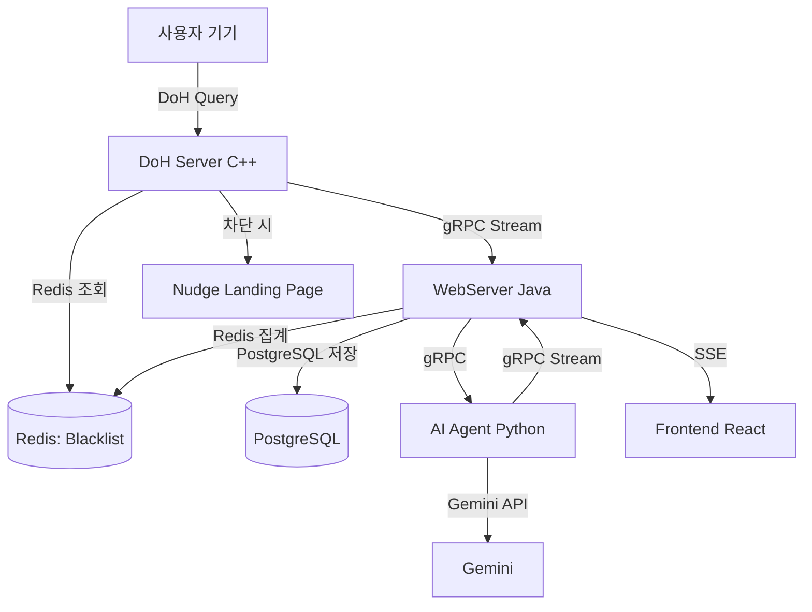

# Detox-Agent: 프로젝트 개요

**버전**: 1.0
**최종 수정**: 2026-03-10

---

## 목차

1. [프로젝트 소개](#1-프로젝트-소개)
2. [핵심 개념](#2-핵심-개념)
3. [시스템 아키텍처](#3-시스템-아키텍처)
4. [서비스 구성](#4-서비스-구성)
5. [핵심 기능](#5-핵심-기능)
6. [기술 스택](#6-기술-스택)
7. [데이터 흐름](#7-데이터-흐름)
8. [비기능 요구사항](#8-비기능-요구사항)
9. [로컬 개발 환경](#9-로컬-개발-환경)

---

## 1. 프로젝트 소개

**Detox-Agent**는 디지털 중독을 단순 강제 차단이 아닌, **DNS 수준의 의식적 개입(Nudge)** 을 통해 사용자가 스스로 인터넷 사용 습관을 교정하도록 돕는 프라이빗 DNS 서비스입니다.

사용자 기기의 DNS 설정을 개인 전용 DoH(DNS-over-HTTPS) 엔드포인트로 변경하는 것만으로, 모든 도메인 접속 이력이 투명하게 수집·분석됩니다. AI가 사용 패턴을 진단하고, 중독성 도메인 사용 시간이 임계값을 초과하면 Nudge 페이지로 개입합니다.

### 목표 사용자

| 사용자 | 니즈 |
|---|---|
| 자기계발 사용자 | 특정 앱·웹 사용 시간을 스스로 제한하고 싶음 |
| 수험생 / 취업 준비생 | 집중력 유지를 위한 인터넷 사용 관리 |
| 자녀를 둔 보호자 | 강압적이지 않은 인터넷 습관 관리 |

---

## 2. 핵심 개념

### DoH 기반 사용자 식별

DoH 쿼리 URL의 경로(`/{dohToken}/dns-query`)에 포함된 개인 토큰으로 사용자를 식별합니다. 별도의 클라이언트 앱 없이 OS 또는 브라우저의 기본 DNS 설정만 변경하면 됩니다.

### Nudge 메커니즘

중독성 태그(`is_addictive`)가 부여된 도메인의 누적 사용 시간이 60분을 초과하면, Redis 블랙리스트에 즉시 등록됩니다. 이후 해당 도메인 접속 시 Nudge Landing Page("현재 1시간째 이용 중입니다. 계속하시겠습니까?")로 리디렉션됩니다.

### AI 기반 분류 및 리포트

Gemini API가 수집된 도메인을 카테고리화(SNS, Game, Adult, Study 등)하고, 일·주·월 단위 사용 패턴을 분석하여 맞춤형 리포트와 차단 후보 도메인을 추천합니다.

---

## 3. 시스템 아키텍처

```
┌──────────────────────────────────────────────────────────────────┐
│                          사용자 기기                               │
│                 (DoH 설정: /{dohToken}/dns-query)                  │
└───────────────────────────┬──────────────────────────────────────┘
                            │ DoH 쿼리 (HTTPS/HTTP2)
                            ▼
┌──────────────────────────────────────────────────────────────────┐
│                      DoH Server (C++)                             │
│               Boost.Beast + Asio + OpenSSL                        │
│                                                                   │
│  ① dohToken으로 사용자 식별                                         │
│  ② Redis 블랙리스트 조회 → 차단 도메인이면 Nudge IP 반환             │
│  ③ 정상 도메인이면 Upstream DNS 포워딩 후 응답                        │
│  ④ 쿼리 이벤트를 gRPC로 WebServer에 실시간 스트리밍 ──────────────► │
└─────────────────────────────────────────┬────────────────────────┘
                                          │ gRPC Client Streaming
                                          ▼
┌──────────────────────────────────────────────────────────────────┐
│                  WebServer (Java / Spring Boot)                    │
│                                                                   │
│  ┌─────────────┐  ┌──────────────────┐  ┌───────────────────┐    │
│  │  Auth API   │  │  Dashboard API   │  │  AI Review SSE    │    │
│  │/api/auth/** │  │ /api/dashboard/**│  │/api/ai/review/... │    │
│  └─────────────┘  └──────────────────┘  └───────────────────┘    │
│                                                                   │
│  ┌─────────────────────────┐  ┌────────────────────────────────┐  │
│  │   Redis (실시간 캐시)    │  │    PostgreSQL (영구 저장소)      │  │
│  │ usage:{userId}:{domain} │  │  users, doh_endpoints          │  │
│  │ stats:daily/weekly/...  │  │  dns_usage_events              │  │
│  └─────────────────────────┘  │  usage_snapshots               │  │
│                                └────────────────────────────────┘  │
└──────────┬───────────────────────────────────────┬────────────────┘
           │ gRPC (UsageData)                       │ SSE
           ▼                                        ▼
┌───────────────────────────┐      ┌────────────────────────────────┐
│    AI Agent (Python)      │      │    Frontend (React / Vite)     │
│  PydanticAI + Gemini API  │      │  - 실시간 통계 대시보드          │
│  - 도메인 AI 분류·태깅     │      │  - AI 리뷰 스트리밍 UI          │
│  - 사용 패턴 분석 리포트   │      │  - 사용 습관 시각화             │
└───────────────────────────┘      └────────────────────────────────┘
```

### 서비스 포트 요약

| 서비스 | 프로토콜 | 포트 | 용도 |
|---|---|---|---|
| DoH Server | HTTPS | 443 / 8443 | DNS-over-HTTPS 수신 |
| WebServer (REST) | HTTP | 8080 | 인증, 대시보드 API |
| WebServer (gRPC) | HTTP/2 | 9090 | DNS 이벤트 수신, AI 데이터 서빙 |
| AI Agent (REST) | HTTP | 8000 | AI 분석 요청 |
| AI Agent (gRPC) | HTTP/2 | 50051 | 토큰 스트리밍 |
| PostgreSQL | TCP | 5432 | 영구 저장 |
| Redis | TCP | 6379 | 실시간 캐시 및 블랙리스트 |

---

## 4. 서비스 구성

### 4.1 DoH Server (C++)

- **역할**: DNS-over-HTTPS 쿼리 수신, 블랙리스트 필터링, Upstream 포워딩
- **핵심 기술**: C++20, Boost.Beast, Boost.Asio, OpenSSL, gRPC, Redis
- **설계 원칙**: Stateless 설계로 수평 확장(Scale-out) 지원, 비동기 처리로 지연 최소화

### 4.2 WebServer (Java / Spring Boot)

- **역할**: 시스템의 중앙 허브. 인증, DNS 이벤트 수집, 통계 집계, API 제공
- **핵심 기술**: Java 21, Spring Boot 4, Spring WebFlux, Spring gRPC, R2DBC, Redis Reactive, JJWT
- **설계 원칙**: 완전 비동기 반응형(Reactive) 아키텍처, Mono/Flux 기반 논블로킹 I/O

> 상세 문서: [`webserver/docs/overview.md`](../webserver/docs/overview.md)

### 4.3 AI Agent (Python)

- **역할**: 도메인 카테고리 분류, 사용 패턴 분석, AI 리포트 생성
- **핵심 기술**: Python 3.13+, PydanticAI, Gemini API, FastAPI, gRPC
- **설계 원칙**: 구조화된 AI 응답 처리, 토큰 스트리밍으로 실시간 UX 제공

### 4.4 Frontend (React / Vite)

- **역할**: 실시간 대시보드, AI 리뷰 UI, 사용 습관 시각화
- **핵심 기술**: React, Vite, SSE(Server-Sent Events)

---

## 5. 핵심 기능

### 5.1 회원가입 및 DoH 엔드포인트 배정

```
POST /api/auth/register → {username, email, password}

WebServer:
  1. username / email 중복 검사
  2. 가장 여유 있는 DoH 엔드포인트 선택 (로드 밸런싱)
  3. 사용자 생성 (BCrypt 해싱)
  4. 32자 랜덤 dohToken 발급
  5. JWT + 개인 DoH URL 반환

응답:
{
  "accessToken": "eyJhbGciOiJIUzI1NiJ9...",
  "tokenType": "Bearer",
  "username": "user123",
  "dohUrl": "https://doh.leeswallow.click/{dohToken}/dns-query"
}
```

발급된 `dohUrl`을 기기 DNS 설정에 등록하면 모든 쿼리가 수집됩니다.

### 5.2 실시간 DNS 이벤트 수집 (gRPC Streaming)

DoH Server → WebServer로 `DnsQueryEvent`를 Client Streaming으로 전송합니다.

```protobuf
service AnalyticsService {
  rpc StreamQueries(stream DnsQueryEvent) returns (Ack);
}

message DnsQueryEvent {
  string user_id        = 1;
  string queried_domain = 2;
  int64  timestamp_us   = 3;
  int64  latency_us     = 4;
}
```

### 5.3 Redis 기반 실시간 사용량 추적

| Redis 키 | 설명 |
|---|---|
| `usage:{userId}:{domain}` | 도메인별 사용량 해시 (firstAccess, lastAccess, count, totalDuration) |
| `usage:index:user:{userId}` | 사용자별 도메인 인덱스 (Sorted Set, score: lastAccess) |
| `stats:daily:{userId}:{date}` | 일별 집계 통계 |
| `stats:weekly:{userId}:{yearWeek}` | 주별 집계 통계 |
| `stats:monthly:{userId}:{yearMonth}` | 월별 집계 통계 |

### 5.4 Nudge 메커니즘 (자동 차단)

1. `is_addictive` 태그 도메인의 `totalDuration` 합산
2. 60분 초과 시 Redis 블랙리스트(`blocked:{userId}:{domain}`)에 즉시 등록
3. 이후 해당 도메인 DNS 쿼리 → Nudge Landing Page IP 반환

### 5.5 AI 분석 리포트 (SSE 스트리밍)

```
Frontend → POST /api/ai/review/stream
         ← SSE: event: token  data: {"type":"token","token":"..."}
                event: done   data: {"type":"done"}
```

WebServer가 AI Agent의 gRPC 스트리밍 응답을 SSE로 변환하여 브라우저에 실시간 릴레이합니다.

---

## 6. 기술 스택

| 서비스 | 언어 | 주요 프레임워크 / 라이브러리 |
|---|---|---|
| DoH Server | C++20 | Boost.Beast, Boost.Asio, OpenSSL, gRPC, hiredis |
| WebServer | Java 21 | Spring Boot 4, WebFlux, Spring gRPC, R2DBC, JJWT |
| AI Agent | Python 3.13+ | PydanticAI, Gemini API, FastAPI, gRPC |
| Frontend | TypeScript | React, Vite |
| 인프라 | - | PostgreSQL, Redis, Docker, Kubernetes |
| CI/CD | - | GitHub Actions |

---

## 7. 데이터 흐름



---

## 8. 비기능 요구사항

| 항목 | 목표 |
|---|---|
| 성능 | DNS 응답 지연 50ms 이내 (gRPC 전송은 비동기 처리) |
| 확장성 | DoH Server Stateless 설계 → 수평 확장 가능 |
| 안정성 | Redis / 분석 서비스 장애 시에도 기본 DNS 기능 유지 (Fail-safe) |
| 보안 | Let's Encrypt TLS, JWT 인증, BCrypt 해싱, DoH 토큰 격리 |
| AI 정확도 | 도메인 카테고리 분류 정확도 90% 이상 |

---

## 9. 로컬 개발 환경

### 사전 요구사항

- Docker & Docker Compose
- Java 21+
- Python 3.13+
- C++20 컴파일러 + vcpkg

### 빠른 시작

```bash
# 1. 인프라 실행 (PostgreSQL + Redis)
docker compose up -d postgres redis

# 2. WebServer 실행
cd webserver && ./gradlew bootRun

# 3. AI Agent 실행
cd agent && python main.py

# 4. DoH Server 빌드 및 실행 (vcpkg 필요)
cd doh-server
cmake -S . -B build -DCMAKE_TOOLCHAIN_FILE=$VCPKG_ROOT/scripts/buildsystems/vcpkg.cmake
cmake --build build
./build/doh-server
```

### 전체 스택 (Docker Compose)

```bash
docker compose up -d --build
```

### 주요 접속 URL

| 서비스 | URL |
|---|---|
| Swagger UI | http://localhost:8080/swagger-ui.html |
| OpenAPI 스펙 | http://localhost:8080/v3/api-docs |
| AI Agent | http://localhost:8000 |

---

> 상세 PRD: [`docs/PRD.md`](PRD.md)
> WebServer 상세: [`webserver/docs/overview.md`](../webserver/docs/overview.md)
