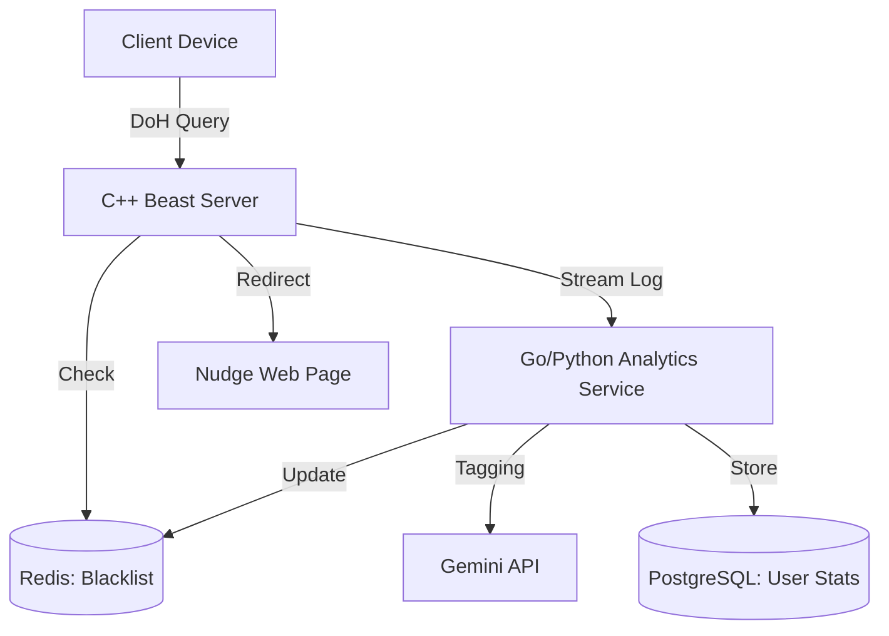

# [PRD] MindfulDNS: DoH 기반 넛지형 디지털 중독 관리 서비스

**버전**: 1.0

**상태**: 초안 (Draft)

**작성일**: 2026-03-08

**주요 기술 스택**: C++20, Boost.Beast, gRPC, Redis, Gemini AI

---

## 1. 제품 목적 (Product Purpose)

현대인의 디지털 중독(SNS, 게임, 숏폼 등)을 단순한 '강제 차단'이 아닌, DNS 수준의 **'의식적 개입(Nudge)'**을 통해 사용자가 스스로 사용 습관을 교정하도록 돕는 프라이빗 DNS 서비스를 제공함.

## 2. 목표 사용자 (Target Audience)

* 특정 앱/웹 사용 시간을 스스로 조절하고 싶은 자기계발 사용자.
* 수험생이나 취업 준비생(공기업/금융권 준비 등) 중 집중력이 필요한 사용자.
* 자녀의 인터넷 사용 습관을 강압적이지 않게 관리하고 싶은 보호자.

---

## 3. 핵심 기능 요구 사항 (Functional Requirements)

### 3.1. 고성능 DoH 포워딩 및 사용자 식별

* **요구 사항**: Let's Encrypt TLS를 적용한 HTTPS 기반 DNS 쿼리 처리.
* **상세 로직**:
* URL Path (`/{user_id}/dns-query`)를 통해 사용자를 식별.
* Stateless 설계를 유지하며 쿼리 메타데이터를 gRPC로 분석 서비스에 실시간 스트리밍.

### 3.2. Redis 기반 실시간 필터링 (Blacklist)

* **요구 사항**: 쿼리 처리 전 Redis를 조회하여 차단 대상 여부 확인.
* **상세 로직**:
* Redis에 해당 유저의 `blocked_domains` 세트가 존재할 경우, Upstream 쿼리를 중단하고 **Nudge Landing Page**의 IP 주소를 반환.

### 3.3. AI 기반 도메인 자동 태깅 및 분류

* **요구 사항**: 수집된 도메인의 중독성 여부를 AI가 판단.
* **상세 로직**:
* Gemini API를 활용하여 도메인을 카테고리화(SNS, Game, Adult, Study 등).
* `is_addictive` 태그를 부여하여 관리 DB에 저장.

### 3.4. 시간 기반 넛지(Nudge) 메커니즘

* **요구 사항**: 특정 태그 도메인의 누적 사용 시간이 1시간 초과 시 개입.
* **상세 로직**:
* 분석 서비스가 gRPC 로그를 합산하여 `addictive` 태그 도메인의 사용 시간이 60분을 넘으면 Redis 블랙리스트에 해당 도메인 즉시 등록.
* 사용자가 재접속 시 경고 페이지로 이동: **"현재 1시간째 이용 중입니다. 계속하시겠습니까?"** 메시지 노출.

### 3.5. AI 리포트 및 지능형 차단 추천

* **요구 사항**: 주기적인 사용량 분석 및 맞춤형 피드백 제공.
* **상세 로직**:
* 일/주/월별 도메인 사용 통계 생성.
* AI가 사용 패턴을 분석하여 "최근 주말 SNS 사용량이 급증했습니다"와 같은 리포트 생성 및 신규 차단 후보 도메인 추천.

---

## 4. 비기능 요구 사항 (Non-Functional Requirements)

* **성능(Performance)**: DNS 응답 지연 시간(Latency) 증가는 최소화해야 하며, gRPC 전송 및 분석은 비동기로 처리함.
* **확장성(Scalability)**: C++ 서버는 Stateless하게 설계하여 트래픽 증가 시 수평적 확장(Scale-out)이 가능해야 함.
* **안정성(Reliability)**: Redis나 분석 서비스 장애 시에도 기본 DNS 기능은 작동해야 함 (Fail-safe).
* **보안(Security)**: Let's Encrypt 인증서를 통한 통신 암호화 및 유효한 `user_id` 경로 외 접근 차단.

---

## 5. 시스템 아키텍처 (System Architecture)

---

## 6. 성공 지표 (Success Metrics)

1. **Retention**: 사용자가 넛지 메시지를 본 후 사용을 중단하는 비율(Exit Rate) 측정.
2. **Performance**: 평균 DNS 응답 시간 50ms 이내 유지.
3. **Accuracy**: AI의 도메인 카테고리 분류 정확도 90% 이상.

---

## 7. `AGENTS.md` & `CLAUDE.md` 연동 지침

* **코드 생성 시**: 모든 C++ 코드는 `vcpkg`로 관리되는 라이브러리(Beast, gRPC)를 사용하며, 비동기 처리를 기본으로 함.
* **로그 기록**: 빌드 및 실행 로그는 반드시 `tee`를 통해 기록하며, 중요 완료 시 `notify-send`로 알림을 울림.

---

**다음 단계로 무엇을 도와드릴까요?**

1. **Redis 연동 로직**: C++ 서버에서 Redis를 조회하여 차단 여부를 결정하는 핵심 코드 구현.
2. **데이터베이스 스키마**: 일/주/월 통계를 위한 PostgreSQL 테이블 설계.
3. **Landing Page**: 사용자의 의지를 묻는 넛지 웹 페이지(SvelteKit 또는 간단한 HTML) 초안 작성.